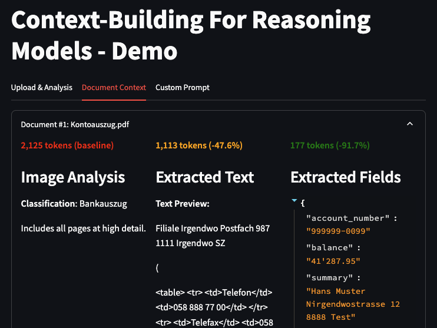

# Token Usage & Context Building Demo


A demonstration tool for exploring different approaches to building context for Large Language Models (LLMs), with a focus on token usage.

## Overview

This demo helps users understand and optimize how they provide context to LLMs by:
- Analyzing different representation formats of PDF documents
- Comparing token usage between different content types
- Visualizing the token cost impact of different context strategies
- Demonstrating context optimization techniques

### Environment Configuration
Create a `.env` file with:
```ini
# Required: Azure Content Understanding credentials
CONTENT_UNDERSTANDING_AI_ENDPOINT=your_endpoint
CONTENT_UNDERSTANDING_AI_KEY=your_key

# Required: Either GitHub or OpenAI credentials
GITHUB_TOKEN=your_token
GITHUB_BASE_URL=your_base_url
# OR
OPENAI_API_KEY=your_key
```

## Usage

1. Start the application:
```bash
streamlit run app.py
```

2. Upload documents:
   - Supports PDF files
   - Currently handles bank statements (Bankauszug) and pay slips (Lohnausweis)

3. Explore token usage:
   - View token counts for different representation methods
   - See how context choices affect total token usage
   - Experiment with different context combinations

4. Build and send prompts:
   - Select which context to include
   - Preview exact message structure
   - See token usage before sending
